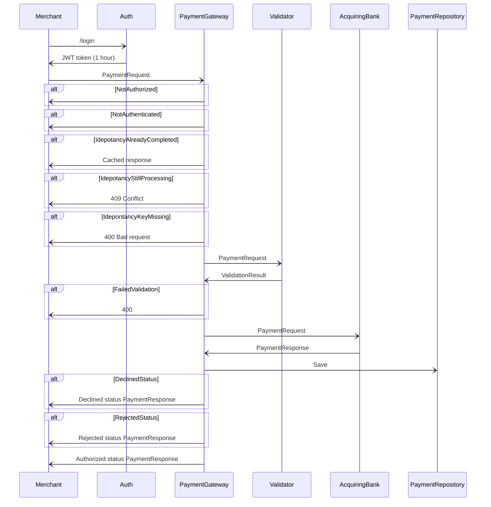

# Arcitecture

```mermaid
sequenceDiagram
    Merchant-)Auth: /login
    Auth-)Merchant: JWT token (1 hour)
    Merchant-)PaymentGateway: PaymentRequest
    alt NotAuthorized
        PaymentGateway-)Merchant:
    end
    alt NotAuthenticated
        PaymentGateway-)Merchant:
    end
    alt IdepotancyAlreadyCompleted
        PaymentGateway-)Merchant: Cached response
    end
    alt IdepotancyStillProcessing
        PaymentGateway-)Merchant: 409 Conflict
    end
    alt IdepontancyKeyMissing
        PaymentGateway-)Merchant: 400 Bad request
    end

    PaymentGateway-)Validator: PaymentRequest
    Validator-)PaymentGateway: ValidationResult
    alt FailedValidation
        PaymentGateway-)Merchant: 400
    end

    PaymentGateway-)AcquiringBank: PaymentRequest
    AcquiringBank-)PaymentGateway: PaymentResponse
    PaymentGateway-)PaymentRepository: Save

    alt DeclinedStatus
        PaymentGateway-)Merchant: Declined status PaymentResponse
    end

    alt RejectedStatus
        PaymentGateway-)Merchant: Rejected status PaymentResponse
    end

    PaymentGateway-)Merchant: Authorized status PaymentResponse
```

# Notes

